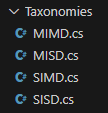
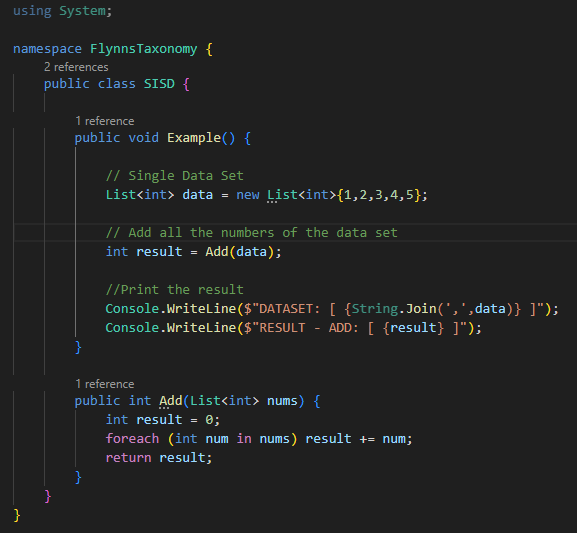
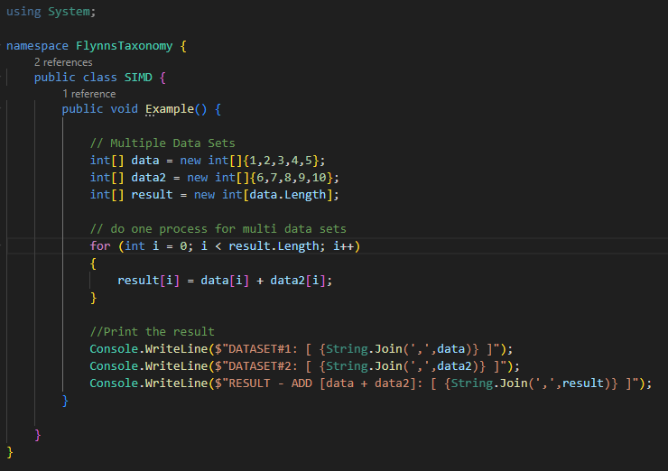
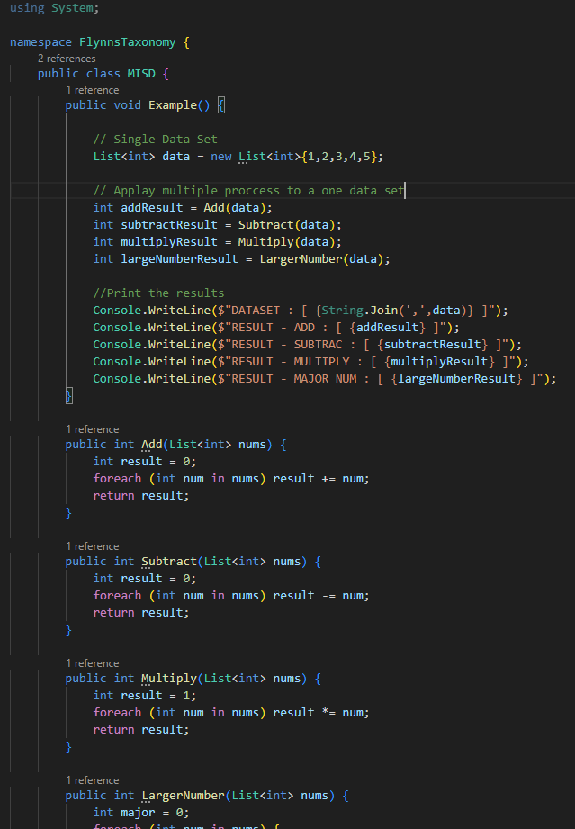
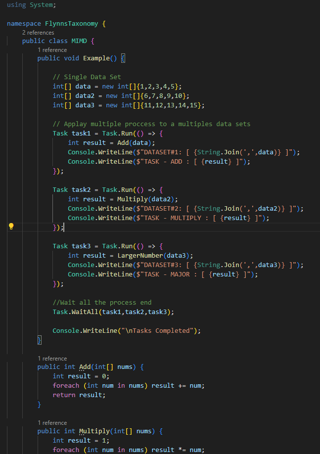
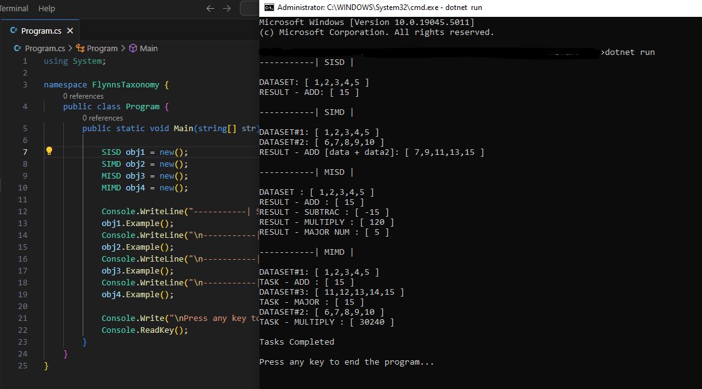

# Practica [ Taxonomias de Flynn ]

Bueno, aqui unos ejemplos muy sencillos de cada taxonomia de Flynn en `C#`, recomiendo ejecutar el projecto en `Visual Studio Code` donde fue hecho para no tener ningun problema :)

- Taxonomias

# Preview Code 

- SISD

- SIMD

- MISD

- MIMD

# Running Program

